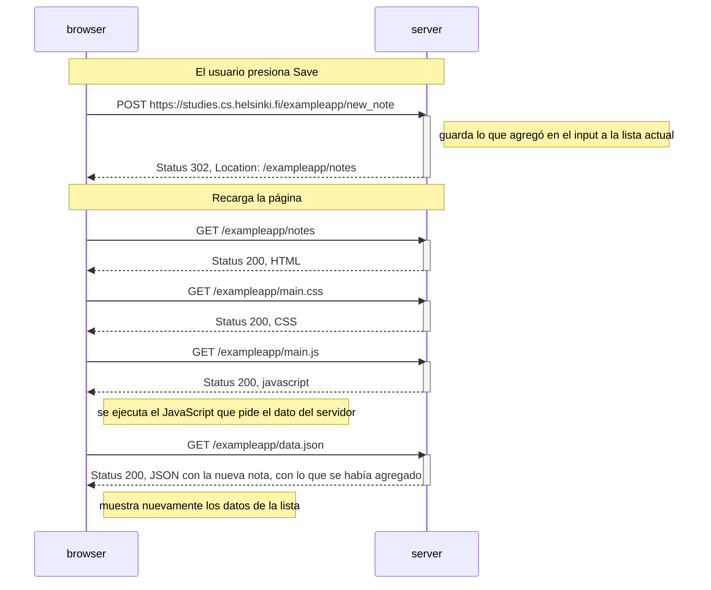

# 0.4: Nueva nota

```mermaid
sequenceDiagram
    participant browser
    participant server

    Note over browser,server: El usuario presiona Save

    browser->>server: POST https://studies.cs.helsinki.fi/exampleapp/new_note
    activate server
    Note right of server: guarda lo que agregó en el input a la lista actual
    server-->>browser: Status 302, Location: /exampleapp/notes
    deactivate server

    Note over browser,server: Recarga la página

    browser->>server: GET /exampleapp/notes
    activate server
    server-->>browser: Status 200, HTML
    deactivate server

    browser->>server: GET /exampleapp/main.css
    activate server
    server-->>browser: Status 200, CSS
    deactivate server

    browser->>server: GET /exampleapp/main.js
    activate server
    server-->>browser: Status 200, javascript
    deactivate server

    Note right of browser: se ejecuta el JavaScript que pide el dato del servidor

    browser->>server: GET /exampleapp/data.json
    activate server
    server-->>browser: Status 200, JSON con la nueva nota, con lo que se había agregado
    deactivate server

    Note right of browser: muestra nuevamente los datos de la lista
```
