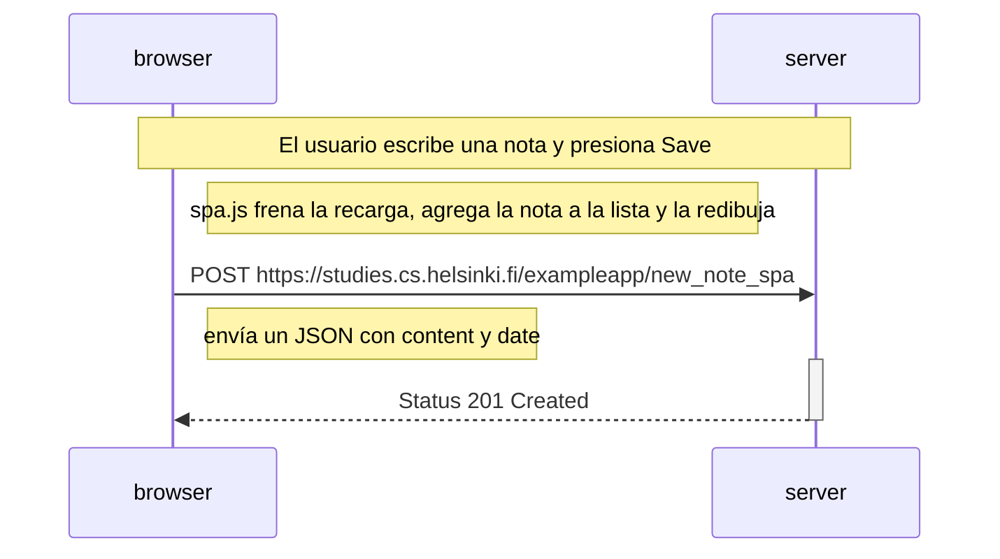

# 0.6: Nueva nota en la aplicación de una sola página

```mermaid
sequenceDiagram
    participant browser
    participant server

    Note over browser,server: El usuario escribe una nota y presiona Save

    Note right of browser: spa.js frena la recarga, agrega la nota a la lista y la redibuja

    browser->>server: POST https://studies.cs.helsinki.fi/exampleapp/new_note_spa
    Note right of browser: envía un JSON con content y date
    activate server
    server-->>browser: Status 201 Created
    deactivate server
```
